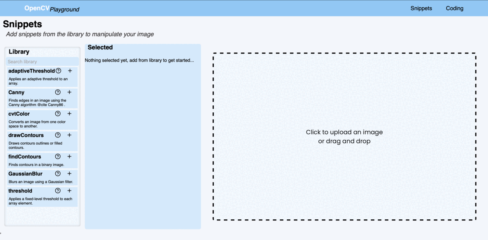

# OpenCV Playground
# Demo

# About
OpenCV Playground is designed to make OpenCV easy for anyone. By uploading an image and choosing from a pregenerated snippet the user can change parameters and view in real time how they effect the output. This is made possible by live python generation in the backend. 

The inspiration from this proejct came from the way numerous online tutorials went about showing how to get started. They would use multiple different filters then have them all open in separate windows. I found this slow, and if the user wanted to see what different parameters did it felt clunky.
# Technologies used
- Python 3
- OpenCV
- Node.js
- React.js
- Express.js

# Setup 
1. Download or clone the repo 
2. run `nmp install`
3. Ensure Python3 and OpenCV is installed
    - **Conda usage example:** 
        - `conda create -n opencv_pg python=3.8`
        - `conda activate opencv_pg`
        - `pip install opencv-python`
4. run `npm start`
5. navigate to local server: [http://localhost:3000](http://localhost:3000)

